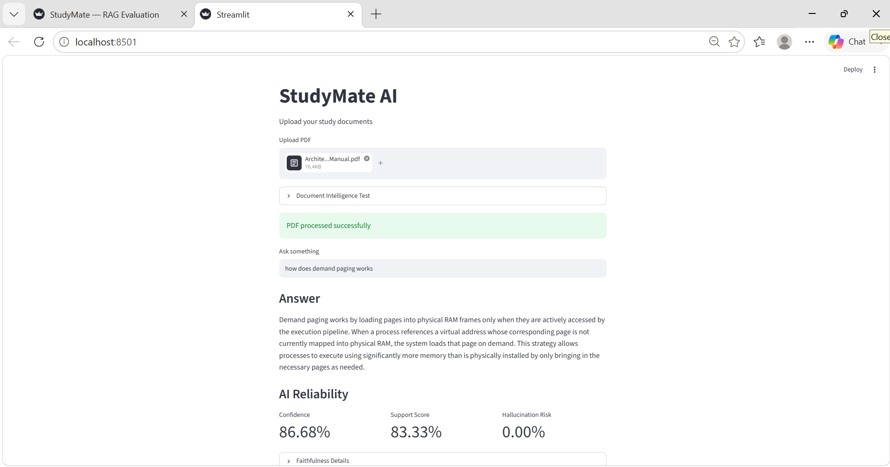
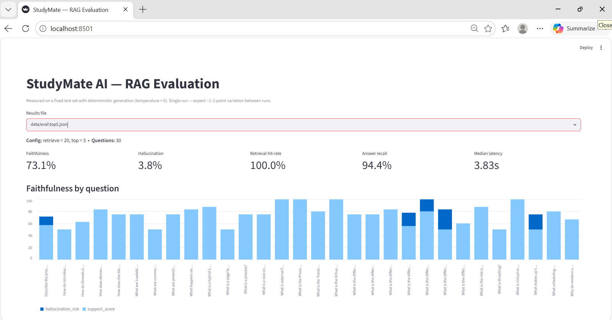

# StudyMate AI

An **explainable document Q&A system** built on Retrieval-Augmented Generation.
Upload study material (PDF), ask questions, and get answers grounded **only** in
your documents — each with source citations, a confidence score, and a
faithfulness check that flags any claim the source doesn't support.

A self-directed project focused on the parts of AI engineering that matter in
production: **grounding, hallucination control, and measured evaluation** — not
just wiring an LLM to a vector store.

## Screenshots

### 🖥️ Chat Interface & Live Pipeline Guardrails
Below is the core application executing an on-the-fly RAG chain. It displays the grounded answer, extracted dynamic metadata citations, and the real-time AI Reliability metrics processing pipeline.



---

### 📊 Evaluation Metrics Dashboard
Below is the analytical dashboard running from `eval_dashboard.py`, visualizing the deterministic system metrics computed over our 30-question test set (`top5.json`).



---

## Evaluation results

Measured on a **30-question test set** over an operating-systems textbook, with
deterministic generation (`temperature=0`) so the numbers are reproducible:

| Metric | Result |
|---|---|
| Faithfulness (answer grounded in source) | **~73%** |
| Hallucination rate (claims contradicted by source) | **~4%** |
| Retrieval (relevant context found, top-5) | 30/30 |
| Answer recall (expected terms present) | 94% |
| Latency (steady-state) | ~3s / query |

### Evaluation methodology

Three decisions made these numbers trustworthy rather than cosmetic:

- **Deterministic generation.** Answers are generated at `temperature=0`, so the
  same question and context produce the same answer. Without this, config
  comparisons just measure sampling noise.
- **Empirical, not assumed, tuning.** An initial top-3 vs top-5 comparison
  favored top-3 — but the result wasn't reproducible. Once generation was made
  deterministic, the comparison **reversed**: top-5 gave higher faithfulness and
  roughly **half the hallucination rate**, so top-5 was adopted. You can't
  compare RAG configurations without first controlling generation randomness.
- **Recognized noise floor.** Even at `temperature=0` the API is only
  *near*-deterministic — re-running the same config varies by ~1–2 points. So
  differences smaller than that are treated as noise; top-5's hallucination
  improvement sat well above the floor, which is why it's reported as a real
  effect (and why headline figures are written as "~73% / ~4%", not false
  precision).

## How it works

```
PDF → text extraction → chunking → embeddings → FAISS (semantic) + BM25 (keyword)
        → hybrid retrieval → cross-encoder rerank → grounded LLM (temperature 0)
        → answer + citations + faithfulness check + confidence
```

The design principle throughout: **the model phrases, the system grounds.**

- **Hybrid retrieval** — combines dense semantic search (FAISS) with sparse
  keyword search (BM25), so it catches both meaning and exact-term matches.
- **Cross-encoder reranking** — re-scores the retrieved candidates with a
  query-aware model (`ms-marco-MiniLM-L-6-v2`) and keeps the best, so the LLM
  sees the most relevant context.
- **Grounded generation** — a strict prompt ("answer only from the provided
  context; if it's not there, say so") at `temperature=0` for faithful,
  repeatable answers.
- **Faithfulness via NLI** — each answer sentence is checked against the
  retrieved context with a natural-language-inference model
  (`nli-deberta-v3-base`). A claim is a **hallucination only when the context
  *contradicts* it**; entailed claims are supported and paraphrases (neutral)
  count as partial. (Demanding strict entailment falsely punishes correct
  paraphrasing — a measurement bug I found and fixed.)
- **Citations** — every answer carries its source document and page, generated
  from retrieval metadata (so they can't be hallucinated).
- **Evaluation harness** — a reproducible test set measuring retrieval,
  faithfulness, recall, and latency, used to tune the pipeline with evidence.

## Tech stack

Python · Streamlit · OpenAI (`gpt-4.1-mini`) · sentence-transformers · FAISS ·
rank-bm25 · cross-encoder reranker · DeBERTa NLI · pypdf

## Project structure

```
src/
├── ingestion/     PDF loading + metadata
├── chunking/      document chunking
├── embeddings/    sentence-transformer embeddings
├── retrieval/     FAISS vector store, BM25, hybrid search, reranker
├── generation/    LLM wrapper, grounded prompt, answer + citation builder
└── evaluation/    NLI faithfulness, confidence scoring, eval harness
app.py             Streamlit app
evaluate.py        run the evaluation harness over a test set
eval_dashboard.py  Streamlit view of the eval results
```

## Running locally

```bash
python -m venv .venv && .venv\Scripts\activate    # Windows
pip install -r requirements.txt
# set OPENAI_API_KEY in a .env file
streamlit run app.py
```

## Evaluation

```bash
# measure the pipeline over a test set (saves results to data/eval/)
python evaluate.py --pdf data/raw_documents/OS.pdf --testset data/eval/testset.json

# view the metrics dashboard
streamlit run eval_dashboard.py
```

## Limitations & next steps

Honest about where this is an MVP:

- **Answer recall is a keyword proxy**, not true correctness. The principled
  upgrade is LLM-as-judge grading against reference answers.
- **The retrieval-hit metric is lenient** (page-or-keyword match); a stricter
  page-only metric would be more discriminating.
- **Hybrid fusion uses a weighted score sum.** Reciprocal Rank Fusion would be
  more robust, since semantic and BM25 scores aren't on the same scale.
- **Single-document at a time**, PDF only; multi-document corpora and a
  highlighted-evidence viewer are natural extensions.
- **Not yet deployed** (runs locally); Streamlit Community Cloud is the next step.

## About

A self-directed project built to practice production RAG engineering — grounding,
NLI-based hallucination detection, and reproducible evaluation — rather than a
"PDF chatbot" demo.
